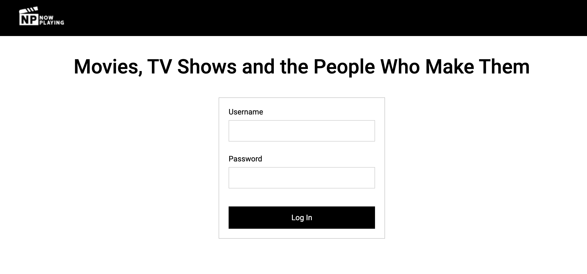
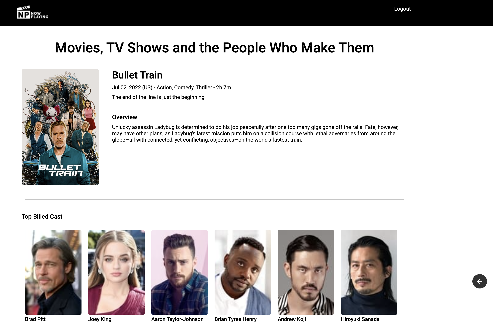

# khs-pwa-now-playing

This repository demonstrates a React-based Progressive Web Application (PWA).  It utilizes a GraphQL API to list movies currently playing at a theater near you. This data is sourced from [The Movie Database API](https://developers.themoviedb.org/3/getting-started/introduction).

It was built solely as an example and learning tool, and it is not intended to be used beyond a learning experience. 

To setup your environment to develop and/or run the application locally, see the [Developer Setup](DEVELOPER-SETUP.md)

This application was seeded using the [React - Progressive Web App](https://create-react-app.dev/docs/making-a-progressive-web-app/) custom template.

The application demonstrates:

* A progressive web app experience
    * Utilizing a manifest.json and service worker configuration to allow "installation" of the application on Desktop and mobile devices
* On mobile devices, your app can be added directly to the home screen, appearing as a "native" application with icon and all -- This eliminates the need for the app store.
* Offline caching
    * The app will work regardless of network state, meaning even if you are offline
    * All static site assets that are a part the build (webpack) are cached -- this makes subsequent visits to more efficient
    * Recently fetched API data (GraphQL) is cached, allowing for Offline usage of the application
    * Recently fetched static data (i.e. images,videos,etc) that is NOT part of the build are cached for offline usage of the application
* Updates are downloaded in the background, and automatically applied, prompting the user for a Refresh when changes are detected.

> NOTE: The application will prompt for a "login", but DOES NOT DO ANY VALIDATION OF LOGIN CREDENTIALS, so any values will work.

### DESKTOP SCREEN SHOTS

#### Login

#### Now Playing

#### Movie Details

